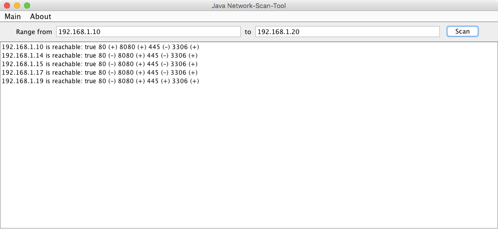

# Network-Scanner
Tiny and overhead free network scanner to find used IP's.

I got several Routers at home. Mostly i forget the IP's. They usual configured anywhere at 
192.168.3.150 and 192.168.3.200. But often i have no glue where exactly.

So i coded this little scanner.

Actually it scans also Ports (80, 8080, SMB and 3306(sql default port))

It has no foreign dependencies and run with JDK > 7.

